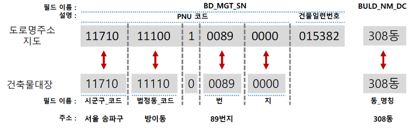

# LocEmb: Location Embedding

* Location Embedding (Currently covering districts and roads in Korea)

### 프로젝트 목표
* 대한민국의 지역 및 장소별 embedding을 제공하고자 함

### 임베딩 결과물 소개
모든 임베딩 결과는 100차원의 vector 형식임.
* 구역 임베딩
    * [embedding+시군구명.csv](embedding+시군구명.csv): 전체 251개 시군구
    * [embedding+법정동명.csv](embedding+법정동명.csv): 전체 5,005개 [법정동](https://namu.wiki/w/법정동)
    * [embedding+행정동명.csv](embedding+행정동명.csv): 전체 3,582개 [행정동](https://namu.wiki/w/행정동)
    * [embedding+도로명+first5000rows.csv](embedding+도로명+first5000rows.csv): 전체 110,722개 [도로명](https://namu.wiki/w/도로명주소) 중 5,000개 샘플
* 업종/상호 임베딩
    * [embedding+상권업종대분류명.csv](embedding+상권업종대분류명.csv): 전체 9개 상권업종대분류명
    * [embedding+상권업종중분류명.csv](embedding+상권업종중분류명.csv): 전체 94개 상권업종중분류명
    * [embedding+상권업종소분류명.csv](embedding+상권업종소분류명.csv): 전체 737개 상권업종소분류명
    * [embedding+상호명+first5000rows.csv](embedding+상호명+first5000rows.csv): 전체 1,482,860개 상호명 중 5,000개 샘플 
* Data available upon request:
    * [embedding+도로명.csv](###임베딩-결과물-소개): 전체 110,722개 도로명
    * [embedding+상호명.csv](###임베딩-결과물-소개): 전체 1,482,860개 상호명
    * [embedding+도로명주소.csv](###임베딩-결과물-소개): 전체 991,559개 도로명주소 (위 상호가 위치하는 도로명주소)
    * [embedding+지번주소.csv](###임베딩-결과물-소개): 전체 987,607개 지번주소 (위 상호가 위치하는 지번주소)

### 임베딩 결과 분석 예제
* [LocEmb-EDA.ipynb](LocEmb-EDA.ipynb): 임베딩 결과값 체크 및 지역별 유사도 계산 예제

### 알고리즘
* Poincare Embedding ([NeurIPS2017](https://papers.nips.cc/paper/7213-poincare-embeddings-for-learning-hierarchical-representations))을 기반으로 위도 및 경도를 추가로 활용하여 각 구역, 도로별 임베딩을 학습함
* 방법론 간단 소개: [슬라이드](http://seondong.github.io/assets/papers/20191213-embedding.pdf)
    - 해당 슬라이드에서 소개한 방법론을 일부 개선하여 적용 중
    - 슬라이드에서 활용한 데이터는 현 프로젝트에서 활용한 데이터와는 상이한 데이터임

### 활용한 데이터
* [공공 중점데이터](https://www.data.go.kr/emphasisData/index.do)의 상권분석 데이터
    - [소상공인시장진흥공단 제공 2019년 12월 상가(상권)정보](https://www.data.go.kr/dataset/15012005/fileData.do)
    - [소상공인시장진흥공단 제공 2019년 9월 상가(상권)정보 의료기관 정보](https://www.data.go.kr/dataset/fileDownload.do?atchFileId=FILE_000000001585497&fileDetailSn=1)

### To-do
* 건물 고유 번호 등으로 추가 확장
* 위, 경도를 활용하는 다른 방법 고안
* GPU computing
* 임베딩을 활용 가능한 예측/분석 테스크 예제 추가
* 추후 코드 공개
<!--
* 위 데이터 이외의 오픈 데이터를 추가 feature로 활용 (활용 가능한 데이터):
    * 주소, 건물DB: http://www.juso.go.kr/addrlink/addressBuildDevNew.do?menu=match
-->

### 임베딩을 활용 가능한 프로젝트 예시
* 장소 추천 / 예측 모델: 고객 동선을 모델링할 때 pretrained된 embedding값을 활용
* 지가 및 분양가 예측 모델: 지역별 embedding값 활용
* 지역별 전염병 확산 / 예측 모델: 감염자의 동선을 활용한 모델 개발시 pretrained된 지역별 embedding값을 covariate으로 활용

### 제반 지식
* Poincare embedding
    - Gensim implementation: https://radimrehurek.com/gensim/models/poincare.html
    - Pytorch implementation: https://github.com/facebookresearch/poincare-embeddings
* PNU코드: https://m.post.naver.com/viewer/postView.nhn?volumeNo=7135987&memberNo=36248235
    - 예시 

<!--
* 건물관리번호 (https://www.vw-lab.com/32):
    - 생성 당시 기준의 PNU + 연번으로 구성됨, 변경되지 않는 고유값
    - 예시 
* PNU ↔ 주소간 상호 변환과 메타데이터: https://m.post.naver.com/viewer/postView.nhn?volumeNo=7242031&memberNo=36248235
* 주소 변환: http://juso.go.kr/dn.do?fileName=%EC%A3%BC%EC%86%8C%EC%A0%84%ED%99%98_%EA%B0%80%EC%9D%B4%EB%93%9C.pdf&realFileName=f493270c-d88f-4852-a807-17a6189a8871.pdf&regYmd=2012
-->

### Contact information
This is an early-stage project. 

For help or issues using LocEmb, please submit a GitHub issue. For personal communication related to LocEmb, please contact Sundong Kim (sundong@ibs.re.kr).