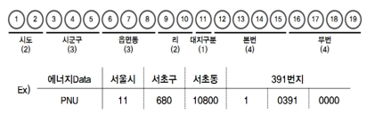

# LocEmb: Location Embedding

* Location Embedding (Currently covering districts, roads, and businesses in Korea) [[PDF]](http://seondong.github.io/assets/papers/2021_IC2S2_LocEmb.pdf)

### 프로젝트 목표
* 대한민국의 지역 및 장소별 embedding을 제공하고자 함

### 임베딩 결과물 소개
모든 임베딩 결과는 100차원의 vector 형식임  
예시) 서울특별시 강남구: [0.0718, -0.0919, ..., -0.103, -0.066]  
&nbsp;&nbsp;&nbsp;&nbsp;&nbsp;&nbsp;&nbsp;&nbsp;&nbsp;서울특별시 강남구 테헤란로: [0.011, 0.000, ..., -0.015, -0.017]  
&nbsp;&nbsp;&nbsp;&nbsp;&nbsp;&nbsp;&nbsp;&nbsp;&nbsp;씨제이 올리브영 종각점: [-0.0363, 0.0177, ..., 0.000, 0.027]  

* 구역 임베딩 결과
    * [embedding+시군구명.csv](embedding+시군구명.csv): 전체 251개 시군구
    * [embedding+법정동명.csv](embedding+법정동명.csv): 전체 5,005개 [법정동](https://namu.wiki/w/법정동)
    * [embedding+행정동명.csv](embedding+행정동명.csv): 전체 3,582개 [행정동](https://namu.wiki/w/행정동)
    * [embedding+도로명+first5000rows.csv](embedding+도로명+first5000rows.csv): 전체 110,722개 [도로명](https://namu.wiki/w/도로명주소) 중 5,000개 샘플
* 업종/상호 임베딩 결과
    * [embedding+상권업종대분류명.csv](embedding+상권업종대분류명.csv): 전체 9개 상권업종대분류명
    * [embedding+상권업종중분류명.csv](embedding+상권업종중분류명.csv): 전체 94개 상권업종중분류명
    * [embedding+상권업종소분류명.csv](embedding+상권업종소분류명.csv): 전체 737개 상권업종소분류명
    * [embedding+상호명+first5000rows.csv](embedding+상호명+first5000rows.csv): 전체 1,482,860개 상호명 중 5,000개 샘플 
* 전체 데이터 (.gz compressed)
    * [embedding+도로명.csv](https://drive.google.com/file/d/1xNTlNcGCbqnE8X_OhDtAmBBVsaJLS0I8/view?usp=sharing): 전체 110,722개 도로명
    * [embedding+상호명.csv](https://drive.google.com/file/d/14mvAliU_844KUgGOSIl2lJZKUTUGhcOF/view?usp=sharing): 전체 1,482,860개 상호명 (예시: 세븐일레븐, 고봉민김밥인)
    * [embedding+상호지점명.csv](https://drive.google.com/file/d/1eJgTRXSrIAIU0r7Jd__I7vh7xu2nAM5H/view?usp=sharing): 전체 319,757개 상호지점명 (예시: 세븐일레븐 카이스트점, 고봉민김밥인 어은점)
    * [embedding+도로명주소.csv](https://drive.google.com/file/d/199uavzGjbeuHlpD2rpani4O9f7zN3sYM/view?usp=sharing): 전체 991,559개 도로명주소 (위 상호가 위치하는 도로명주소)
    * [embedding+지번주소.csv](https://drive.google.com/file/d/1sf3Kg8wxBQ-q6WJpDLjTu1Sl7An79qPG/view?usp=sharing): 전체 987,607개 지번주소 (위 상호가 위치하는 지번주소)

### 임베딩 결과 분석 예제
* [LocEmb-EDA.ipynb](LocEmb-EDA.ipynb): 임베딩 결과값 체크 및 지역별 유사도 계산 예제

* 유사도 분석 결과: 

    * 예시 1) 대전광역시 유성구 신성동과 가장 유사도가 높은 전국의 행정동
        | 행정동명  | 유사도 |
        | ------------- | ------------- |
        | 대전광역시 유성구 관평동 | 97.81% |
        | 대전광역시 유성구 전민동 | 97.33% |
        | 대전광역시 유성구 구즉동 | 96.08% |
        | 대전광역시 유성구 온천2동 | 94.95% |
        | 대전광역시 서구 만년동 | 93.46% |
        
    * 예시 2) 대전광역시 유성구 어은동에 위치한 '플라스틱플랜트'와 가장 유사도가 높은 전국의 상호
        | 상호명  | 유사도 |
        | ------------- | ------------- |
        | 두메숯불바베큐 | 99.54% |
        | 요시다 | 99.52% |
        | 올리브가든수제파이전문점 | 99.44% |
        | 짜카밥 | 99.39% |
        | 기시맹 | 99.38% |

* 교차 분석 결과: 상권 업종 임베딩 결과와 도로명 임베딩 결과를 활용하여, 특정 업종과의 유사도가 높은 도로를 리스트업한 후 실제로 해당 업종 상호가 많은 지 검색을 통해 검증함

    * 예시 1) 상권업종대분류명 '숙박'의 임베딩 결과와 가장 유사도가 높은 지역별 도로
        | 도로명  | 유사도 |
        | ------------- | ------------- |
        | __경기도 가평군 북면 백둔로133번길__ | 95.01% |
        | 충청남도 태안군 남면 진산1길 | 94.00% |
        | 경상남도 남해군 남면 빛담촌길 | 92.33% |
        | 충청남도 보령시 해수욕장12길 | 90.55% |
        | 충청남도 태안군 안면읍 사냥메기길 | 90.49% |
        | 강원도 강릉시 해안로621번길 | 90.25% |
        | 전라남도 여수시 남면 우두로 | 89.26% |
        | 강원도 홍천군 서면 도롱골길147번길 | 87.64% |
        | 경상북도 경주시 서낭길 | 85.95% |
        * 가장 유사도가 높은 __'경기도 가평군 북면 백둔로133번길'__ 과 주변의 숙박 업소 [[카카오맵](http://kko.to/UiJgzhLj0)]
    <a href="url"></a>
    
    * 예시 2) 상권업종중분류명 '유흥주점'의 임베딩 결과와 가장 유사도가 높은 지역별 도로
        | 도로명  | 유사도 |
        | ------------- | ------------- |
        | 강원도 원주시 토지길 | 73.37% |
        | __서울특별시 서대문구 연세로7안길__ | 73.34% |
        | 전라남도 여수시 시청동5길 | 70.39% |
        | 대구광역시 수성구 수성못6길 | 70.34% |
        | 서울특별시 용산구 이태원로27가길 | 69.72% |
        | 전라북도 전주시 완산구 홍산중앙로 | 69.69% |
        | 충청북도 충주시 연수상가길 | 66.32% |
        | 대전광역시 유성구 온천북로13번길 | 64.91% |
        | 전라남도 목포시 원형로 | 64.58% |
        | 서울특별시 마포구 홍익로5길 | 64.08% |
        * 두 번째로 유사도가 높은 __'서울특별시 서대문구 연세로7안길'__ 과 주변의 유흥주점 [[카카오맵](http://kko.to/p3xn-OLjM)]
    <a href="url"></a>

### 임베딩 알고리즘
Concept map을 활용하여 heterogeneous hierarchical structures을 통합, hyperbolic space에 함께 임베딩한 방법론으로 구역 정보와 함께 위도 및 경도, 상권 분류명 정보를 활용하여 각 구역, 도로, 상권별 임베딩을 학습함  
    <a href="url"></a>
    <!--[임베딩_아키텍처](fig/hier-emb.png)  [Working Paper](###임베딩-알고리즘) -->
* Algorithm Description [[PDF]](./LocEmb.pdf)
* 관련 연구 설명 및 유사 데이터를 활용한 분석 결과 [[슬라이드]](http://seondong.github.io/assets/papers/20191213-embedding.pdf)

### 임베딩에 활용한 데이터
* [공공데이터포털 국가중점데이터](https://www.data.go.kr/emphasisData/index.do) 중 상권분석 데이터
    - [소상공인시장진흥공단 제공 2019년 12월 상가(상권)정보](https://www.data.go.kr/dataset/15012005/fileData.do)
        <!-- [소상공인시장진흥공단 제공 2019년 9월 상가(상권)정보 의료기관 정보](https://www.data.go.kr/dataset/fileDownload.do?atchFileId=FILE_000000001585497&fileDetailSn=1)  -->

### 임베딩 결과를 활용 가능한 프로젝트
* 장소 추천 / 예측 모델: 고객 동선을 모델링할 때 pretrained된 embedding값을 활용
* 지가 및 분양가 예측 모델: 지역별 embedding값을 covariate으로 활용
* 지역별 전염병 확산 / 예측 모델: 감염자의 동선을 활용한 모델 개발시 pretrained된 지역별 embedding값을 covariate으로 활용

### 관련 정보
* Poincare embedding ([NeurIPS2017](https://papers.nips.cc/paper/7213-poincare-embeddings-for-learning-hierarchical-representations))
    - Gensim implementation: https://radimrehurek.com/gensim/models/poincare.html
    - Pytorch implementation: https://github.com/facebookresearch/poincare-embeddings
* PNU코드: https://m.post.naver.com/viewer/postView.nhn?volumeNo=7135987&memberNo=36248235
    

<!--
* 건물관리번호 (https://www.vw-lab.com/32):
    - 생성 당시 기준의 PNU + 연번으로 구성됨, 변경되지 않는 고유값
    - 예시 
* PNU ↔ 주소간 상호 변환과 메타데이터: https://m.post.naver.com/viewer/postView.nhn?volumeNo=7242031&memberNo=36248235
* 주소 변환: http://juso.go.kr/dn.do?fileName=%EC%A3%BC%EC%86%8C%EC%A0%84%ED%99%98_%EA%B0%80%EC%9D%B4%EB%93%9C.pdf&realFileName=f493270c-d88f-4852-a807-17a6189a8871.pdf&regYmd=2012
-->

### To-do
* 건물 고유 번호 등으로 추가 확장
* 위, 경도를 활용하는 다른 방법 고안
* GPU computing
* 임베딩을 활용 가능한 예측/분석 테스크 예제 추가
* 페이퍼 작성 및 코드 공개
<!--
* 위 데이터 이외의 오픈 데이터를 추가 feature로 활용 (활용 가능한 데이터):
    * 주소, 건물DB: http://www.juso.go.kr/addrlink/addressBuildDevNew.do?menu=match
-->

### License

[Creative Commons Attribution-ShareAlike license (CC BY-SA 4.0)](http://creativecommons.org/licenses/by-sa/4.0/)


### Citation
If you mention LocEmb for your publication, please cite the paper:
```LaTeX
@inproceedings{kim2021locemb,
  title={Embedding Heterogeneous Hierarchical Structures},
  author={Kim, Sundong},
  booktitle = {7th International Conference on Computational Social Science},
  year={2021}
}
```

### Contact information
This is an early-stage project. 

For help or issues using LocEmb, please submit a GitHub issue. For communication and collaboration related to LocEmb, please contact Sundong Kim (sundong@ibs.re.kr).